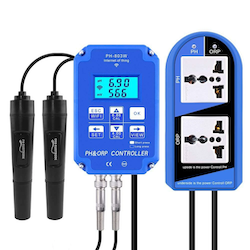

# node-ph803w

Library to interact locally with PH-803W devices

## Device details

The PH803W device is internally an ESP which uses the GizWits platform. With this the device offers two ways of communication:
* The device connects to the gizwits cloud via MQTT and publishs the device data there, where the Android app gets the data from
* The device also offers local options via UDP for discovery and setup (Onboarding) and also a TCP interface for communication with the device and to request data

This library is focussing on the local LAN interface via UDP and TCP.

## LAN communication protocol

Please see [Protocol page](PROTOCOL.md).

## Usage

The library is documented in code (Apidoc) and example scripts show the usage

Available examples (see example folder):
* data.js: Skript to connect to a device via IP, authenticate and retrieve data
* discovery.js: Skript to discover devices in the network

## Changelog

### __WORK IN PROGRESS__
* (Apollon77) trigger disconnected event also on pingpong related reconnects

### 0.2.3 (2021-06-08)
* (Apollon77) enhance test server logging

### 0.2.2 (2021-06-08)
* (Apollon77) enhance test server

### 0.2.1 (2021-06-08)
* (Apollon77) BREAKING: Rename redoxSwitch/phSwitch to redoxOutlet/phOutlet in data response

### 0.1.2 (2021-06-08)
* (Apollon77) Optimize handling of parallel received data packages

### 0.1.1 (2021-06-08)
* (Apollon77) Add handling of parallel received data packages

### 0.1.0 (2021-06-08)
* (Apollon77) Initial release